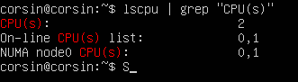
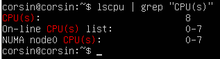
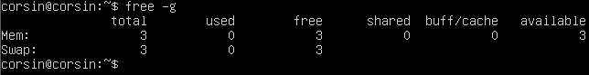
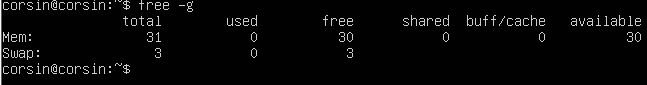

# Dokumentation Modul 346

## KN01 Virtualisierung

#### Erklärungen

1. Fehlermeldung: Nicht genügend RAM um die Virtuelle Maschiene zu betreiben.
   Grund:   Maximal 32GB RAM sind erlaubt, mehr nicht.

***

##### Flexible Ressourcenallokation: 
Viele Virtualisierungsplattformen ermöglichen eine flexible Ressourcenallokation, bei der virtuelle Maschinen je nach Bedarf mehr Ressourcen erhalten können, solange sie innerhalb der Gesamtkapazität des Hostsystems bleiben. Dies bedeutet, dass Sie vorübergehend einer virtuellen Maschine mehr Ressourcen zuweisen können, ohne das Hostsystem zu überlasten.

##### Overcommitment: 
Virtualisierungstechnologien ermöglichen oft Overcommitment, was bedeutet, dass Sie virtuellen Maschinen mehr Ressourcen zuweisen können, als tatsächlich physisch vorhanden sind. Dies basiert auf der Annahme, dass nicht alle virtuellen Maschinen ihre zugewiesenen Ressourcen gleichzeitig nutzen. Solange die Gesamtsumme der zugewiesenen Ressourcen die tatsächliche Kapazität des Hostsystems nicht übersteigt, können Sie einer virtuellen Maschine mehr Ressourcen zuweisen, als auf dem Hostsystem verfügbar sind.

##### Dynamische Ressourcenzuweisung: 
Moderne Virtualisierungstechnologien wie VMware und Hyper-V ermöglichen eine dynamische Ressourcenzuweisung, bei der Ressourcen basierend auf dem aktuellen Bedarf der virtuellen Maschinen zugewiesen werden. Dadurch können virtuelle Maschinen vorübergehend mehr Ressourcen erhalten, wenn sie diese benötigen, auch wenn dies die verfügbaren Ressourcen des Hostsystems überschreitet.

##### Ressourcenmanagement auf dem Hostsystem: 
Es ist möglich, dass das Hostsystem so konfiguriert ist, dass es weniger Ressourcen für sich selbst reserviert, um virtuellen Maschinen Priorität einzuräumen. Dies könnte durch Konfigurationen wie Prioritätszuweisungen oder Reservierungen erreicht werden, die sicherstellen, dass die virtuellen Maschinen die benötigten Ressourcen erhalten, selbst wenn dies bedeutet, dass das Hostsystem weniger Ressourcen für sich selbst hat.

Es ist jedoch wichtig zu beachten, dass das Überschreiten der Kapazität des Hostsystems durch virtuelle Maschinen zu einer Überlastung führen kann, die sich negativ auf die Leistung aller virtuellen Maschinen sowie des Hostsystems auswirken kann. Daher sollte dies sorgfältig verwaltet und überwacht werden, um eine optimale Leistung und Stabilität sicherzustellen.

***

Dieses Kapitel war ein kurzer Einstieg für das Modul 346. Hier zum einstieg mussten wir die Ressourcezuteilung von der neu erstellten VM überprüfen.

>Weniger CPU als Hostsystem

>Mehr CPU als Hostsystem

>Weniger RAM als Hostsystem

>Mehr RAM als Hostsystem

***

## KN02 IaaS - Virtuelle Server

#### A) AWS Kurs
##### a) Lab 4.1 - EC2

Bei dieser Aufgabe musste ich eine Instanz erstellen über den AWS Academy. Das Ziel dabei ist, dass man eine HTML Seite hochlädt und sie anschliessend über den Browser mit dem URL Code über den AWS abruft.

>Hier ist ein Beispiel was ich einstellen musste, damit ich meine HTML Datei auf den Webserver abrufen kann. Bei der Sicherheitsgruppe habe ich für den ausgehenden Datenverkehr eine hinzugefügt, damit meine HTML Seite nicht blockiert wird.

>Da kann man einige Informationen über die Instanz herauslesen.

>Hier ist meine neu erstellte Instanz, wie man sehen kann, gibt es viele Einstellungen die man Benutzerdefiniert einstellen kann. Und wenn ich jetzt auf die Öffentliche IPv4-Adresse klicke, öffnet sich die HTML Seite in einem neuen Browsertag.

***

##### b) Lab 4.2 - S3

Bei dieser Aufgabe geht es darum ein Bucket zu erstellen. 

>Als erstes musste ich die Blockierung vom öffentlichen Zugang beheben. Dazu musste ich in der *Edit Block public access* in allen Checkboxen abwählen und anschliessend Speichern.

>Nachdem ich die die Blockierung aufbehoben habe, fügte ich unter der *Bucket policy* ein JSON Code ein.

>Hier wird das ausgewählte Bild im *Index document* 
