# Dokumentation Modul 346

## KN01 Virtualisierung

#### A) Installieren Sie Virtualbox oder andere Virtualisierungssoftware
In dieser Aufgabe arbeite ich mit der VMWare Workstation Pro, da ich schon einige Erfahrungen gemacht habe mit diesem Programm. Das VMWare Workstation Pro Programm ist ein Virtualisierungssoftware.

#### B) Erstellen Sie ihre erste VM
Nachdem ich die VMWare Workstation Pro auf dem Laptop installiert habe, konnte ich mit der aufgabe B starten. In Aufgabe B geht es darum Ubuntu auf einer VM zu installieren.
Zuerst musste ich die konfigurationen machen in der VMWare Workstation Pro, um später die **ISO Image Datei** in die VM einbinde.

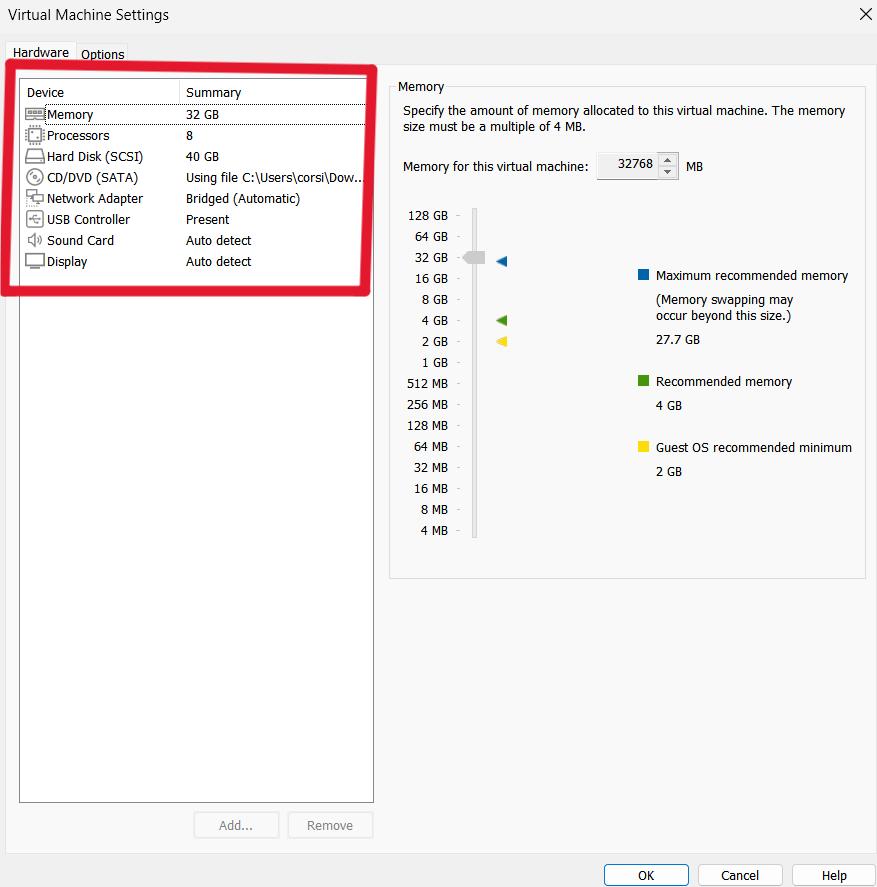

>Nachdem ich alles fertig konfiguriert habe, konnte ich nun die **ISO Image Datei** in die VM einbinden.

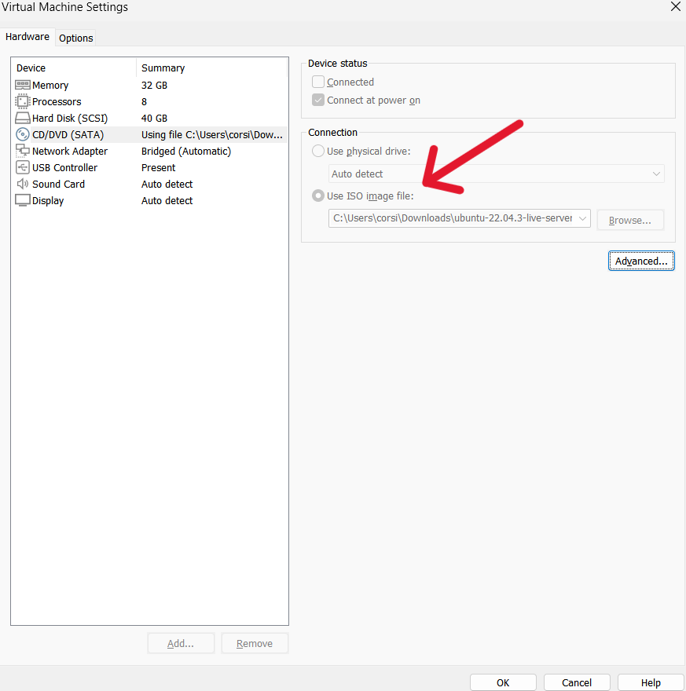

#### Problemen
1. Fehlermeldung: Nicht genügend RAM um die Virtuelle Maschiene zu betreiben.
   Grund:   Maximal 32GB RAM sind erlaubt, mehr nicht.

#### C) Ressourcenzuteilung
Dieses Kapitel war ein kurzer Einstieg für das Modul 346. Hier zum einstieg mussten wir die Ressourcezuteilung von der neu erstellten VM überprüfen.


>Weniger CPU als Hostsystem


>Mehr CPU als Hostsystem


>Weniger RAM als Hostsystem


>Mehr RAM als Hostsystem

***

## KN02 IaaS - Virtuelle Server


#### A) AWS Kurs
Wir arbeiten hauptsächlich mit AWS (Amazon Web Services), da AWS extra für Lernende ein Lerner Lab zur verfügung stellt und dazu 100$ zum Ausprobieren. Nachdem die 100$ abgelaufen sind, muss man selber zahlen, wenn man weiter machen möchte. Aber das gute daran ist, die 100$ werden sehr langsam verbraucht.

#### a) Lab 4.1 - EC2
Bei dieser Aufgabe musste ich eine Instanz erstellen über den AWS Academy. Das Ziel dabei ist, dass man eine HTML Seite hochlädt und sie anschliessend über den Browser mit dem URL Code über den AWS abruft.


>Hier ist ein Beispiel was ich einstellen musste, damit ich meine HTML Datei auf den Webserver abrufen kann. Bei der Sicherheitsgruppe habe ich für den ausgehenden Datenverkehr eine hinzugefügt, damit meine HTML Seite nicht blockiert wird.


>Da kann man einige Informationen über die Instanz herauslesen.


>Hier ist meine neu erstellte Instanz, wie man sehen kann, gibt es viele Einstellungen die man Benutzerdefiniert einstellen kann. Und wenn ich jetzt auf die Öffentliche IPv4-Adresse klicke, öffnet sich die HTML Seite in einem neuen Browsertag.


>Das ist das Endergebnis, wenn man alles korrekt gemacht hat.

***

#### b) Lab 4.2 - S3

Bei dieser Aufgabe geht es darum ein Bucket zu erstellen. 


>Als erstes musste ich die Blockierung vom öffentlichen Zugang beheben. Dazu musste ich in der *Edit Block public access* in allen Checkboxen abwählen und anschliessend Speichern.


>Nachdem ich die die Blockierung aufbehoben habe, fügte ich unter der *Bucket policy* ein JSON Code ein.


>Hier wird das ausgewählte Bild im *Index document* eingetragen

#### B) Zugriff mit SSH-Key
Nachdem wir die Keypairs erstellt haben, sollten sie in der Keypair Liste erscheinen.
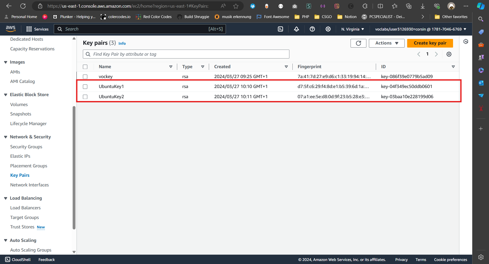
>Hier noch die Verlinkung wie ein **.pem Key** aussehen sollte:
[UbuntuKey1.pem](<KN02/Aufgabe B)/UbuntuKey1.pem>)
[UbuntuKey2.pem](<KN02/Aufgabe B)/UbuntuKey2.pem>)
#### C) Installation von Web- und Datenbankserver

***

## KN03: Cloud-init und AWS

#### A) Cloud-init Datei Verstehen
Ich habe ein YAML-File abgelegt in diesem Ordner. Der name des Files lautet "cloud-init.yaml"
```yaml
#cloud-config
users: # Benutzer: Eine Liste von Benutzerkonten, die erstellt werden sollen
  - name: ubuntu # Benutzername: Der Name des Benutzerkontos
    sudo: ALL=(ALL) NOPASSWD:ALL # sudo-Regeln für diesen Benutzer: Ermöglicht dem Benutzer, sudo ohne Passwortabfrage zu verwenden
    groups: users, admin # Gruppen: Die Benutzergruppen, denen der Benutzer angehört
    home: /home/ubuntu # Home-Verzeichnis: Das Home-Verzeichnis für den Benutzer
    shell: /bin/bash # Shell: Die Standard-Shell für den Benutzer
    ssh_authorized_keys: # SSH-Schlüssel: Eine Liste von öffentlichen SSH-Schlüsseln, die für den SSH-Zugang autorisiert sind
      - ssh-rsa AAAAB3NzaC1yc2EAAAADAQABAAABAQDDrWe5HIeF6ZtLUeACx1T6OCKKM4h2Os24bLmd7xs00M6hRfYQFzyMMHxNIFdWAHu0aqKDYieWn407HANn5nFqbV4vClJeBl76RdM5v2yZXH5KTf2URd1JG1vkFNgdfb0nHWXXpAJYkELkcPwxgOCB2YFATWuOtDQpCb5J265bH5oDeozdB5+vgfypQ2ttK8h8258NJV/es2/SYzXW89OXuPKphLkb98r8L9FyBZyonZCCkmQjPSV2UKeN44zPUjDdJo1fIE1zusam/JXLZQmY4Rad/UNJE/q5W2XtV8OPXKZtEOmDtqZWwEHm8P8G9RaFnqk6tn1fJl72oBxHbRKr aws-key
ssh_pwauth: false # SSH-Passwortauthentifizierung: Deaktiviert die Möglichkeit, sich mit einem Passwort über SSH anzumelden
disable_root: false # Root-Login deaktivieren: Erlaubt oder verbietet den Root-Login
package_update: true # Paketaktualisierung: Aktiviert die Aktualisierung von Paketen beim Start
packages: # Pakete: Eine Liste von Paketen, die beim Start installiert werden sollen
  - curl 
  - wget
```

#### B) SHH-Key und Cloud-init

Beim generieren der beiden Public Keys hatte ich ein problem. Ich konnte keine Public Keys aus den Private Keys generieren, weil mein Rechner blockiert es. Deshalb musste ich es auf einen anderen Rechner probieren (PC von zuhause) und dort hat es funktioniert.

- [erster Publickey](<KN03/B)SSH-Key und Cloud-init/copo_1.pub>)
- [zweiter Publickey](<KN03/jowi-1.pub>)

#### C) Template

Nachdem ich die Public Keys generiert hatte, fügte ich den in mein yml File ein. Dazu fügte ich den Publickey von unserer Lehrperson ebenso ein, damit beide Benutzer (Ich, Lehrperson) Zugriff haben.

```yaml
#cloud-config
users: # Benutzer: Eine Liste von Benutzerkonten, die erstellt werden sollen
  - name: ubuntu # Benutzername: Der Name des Benutzerkontos
    sudo: ALL=(ALL) NOPASSWD:ALL # sudo-Regeln für diesen Benutzer: Ermöglicht dem Benutzer, sudo ohne Passwortabfrage zu verwenden
    groups: users, admin # Gruppen: Die Benutzergruppen, denen der Benutzer angehört
    home: /home/ubuntu # Home-Verzeichnis: Das Home-Verzeichnis für den Benutzer
    shell: /bin/bash # Shell: Die Standard-Shell für den Benutzer
    ssh_authorized_keys: # SSH-Schlüssel: Eine Liste von öffentlichen SSH-Schlüsseln, die für den SSH-Zugang autorisiert sind
      - ssh-rsa AAAAB3NzaC1yc2EAAAADAQABAAABAQDDrWe5HIeF6ZtLUeACx1T6OCKKM4h2Os24bLmd7xs00M6hRfYQFzyMMHxNIFdWAHu0aqKDYieWn407HANn5nFqbV4vClJeBl76RdM5v2yZXH5KTf2URd1JG1vkFNgdfb0nHWXXpAJYkELkcPwxgOCB2YFATWuOtDQpCb5J265bH5oDeozdB5+vgfypQ2ttK8h8258NJV/es2/SYzXW89OXuPKphLkb98r8L9FyBZyonZCCkmQjPSV2UKeN44zPUjDdJo1fIE1zusam/JXLZQmY4Rad/UNJE/q5W2XtV8OPXKZtEOmDtqZWwEHm8P8G9RaFnqk6tn1fJl72oBxHbRKr aws-key
      - ssh-rsa AAAAB3NzaC1yc2EAAAADAQABAAABAQDwOUB06MwDY5U9La6NPNFVYoeAFnLJu5fHGS1lR2Wp//jXFlURZjHSF5f3hfgQKw9Tr8Qn8cf2Gf7YHjhwto249aqNburKmBhcLuVoEqvtWlxY1lABS9YBa7xIeDCWBSeB2642yX4vhtW+c99KcSdYrereGnZVUWHfygWi2z4O3L2klA+qmRNchx9PMyjahWB72JOw9WjvOMdYa6sXzKZ7KtPojl6mxCW5RT8BTQgApMg7SWTqFYCysbX+j8P8JaC0sCQX1QpRV3dKI5ujJnPMu8ijfbfcfgS1ZKRVLE5R7ZYOddVgwMj6O2aGbICKaX1CrsaSKsytOiwylxnigrwL aws-key
ssh_pwauth: false # SSH-Passwortauthentifizierung: Deaktiviert die Möglichkeit, sich mit einem Passwort über SSH anzumelden
disable_root: false # Root-Login deaktivieren: Erlaubt oder verbietet den Root-Login
package_update: true # Paketaktualisierung: Aktiviert die Aktualisierung von Paketen beim Start
packages: # Pakete: Eine Liste von Paketen, die beim Start installiert werden sollen
  - curl 
  - wget
```

#### D) Auftrennungvon Web- und Datenbankserver

## KN04

#### A) Bild erstellen und auf S3 hosten

In dieser Aufgabe wird das gleiche Konzept wie in KN02 gemacht. Als erstes müssen wir ein neuen *Bucket* erstellen, welches wieder mit einem Bild gehostet wird.
Zuerst musste ich ein neuen Bucket erstellen und die Public Access entfernen, damit die Website die ich am Ende abrufen möchte blockiert wird.
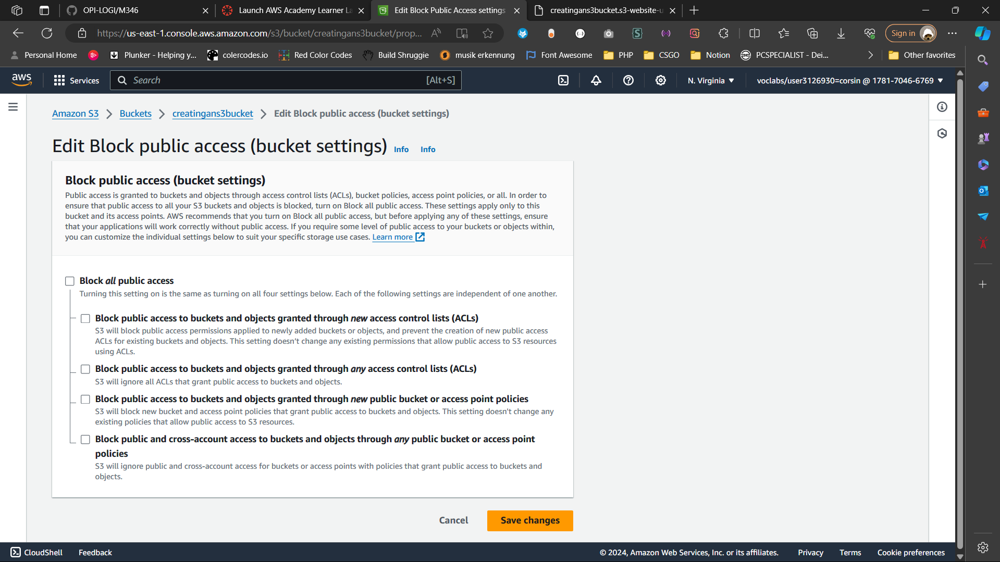
Dann mussten wir die Storage Klasse auf Standart setzten, wobei es eigentlich immer Standartmässig auf Standart gesetzt ist.
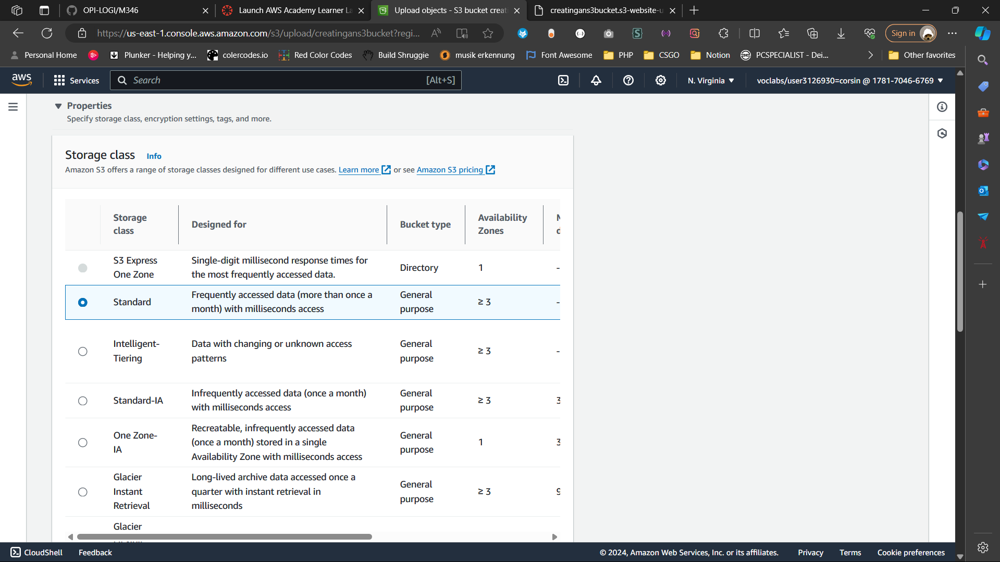
Nachdem ich den S3 Bucket erstellt hatte, musste ich bei der Bucket Policy ein kleines JSON-Skript einfügen. Diese ist dafür für die Regeln und Rechte für das Bucket, welches man Zugang hat.
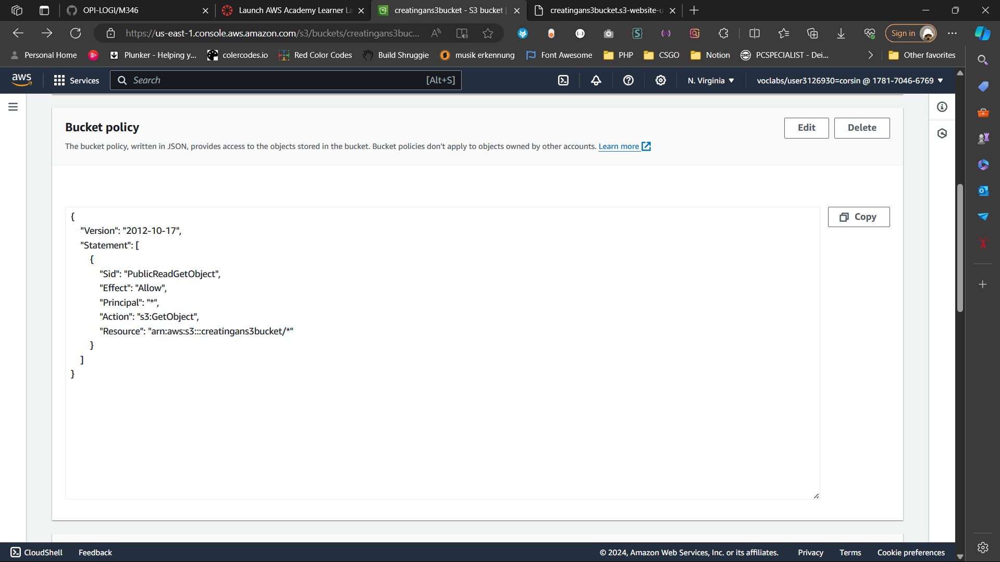
Nun musste ich hier das gewünschte Bild hochladen, welches ich später gerne auf meiner gehosten Website erscheinen lassen möchte.
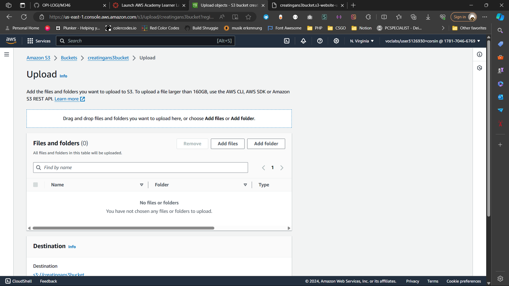
So sollte es dann aussehen, wenn es hochgeladen wurde. (Habe ausversehen die html Datei mithochgeladen)
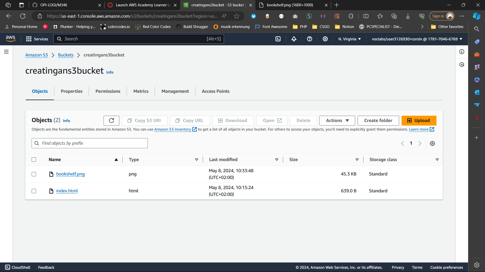
Wenn ich jetzt zurück zu meine erstellten Buckets gehe, kann ich auf den Bucket klicken und dann sollte ein Link unten geknüpft sein.
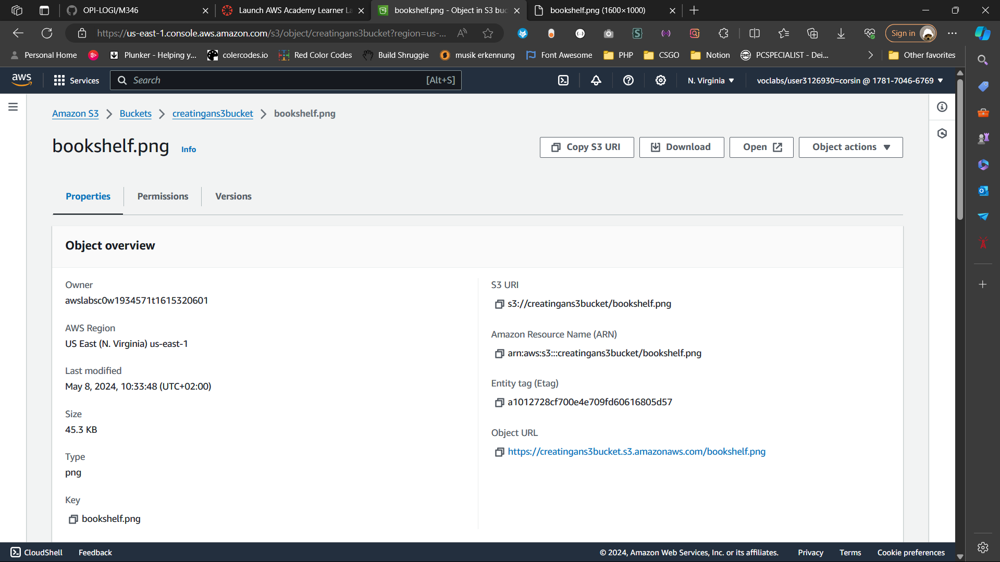
Und wenn ich auf den Link klicke erscheint diese Seite.
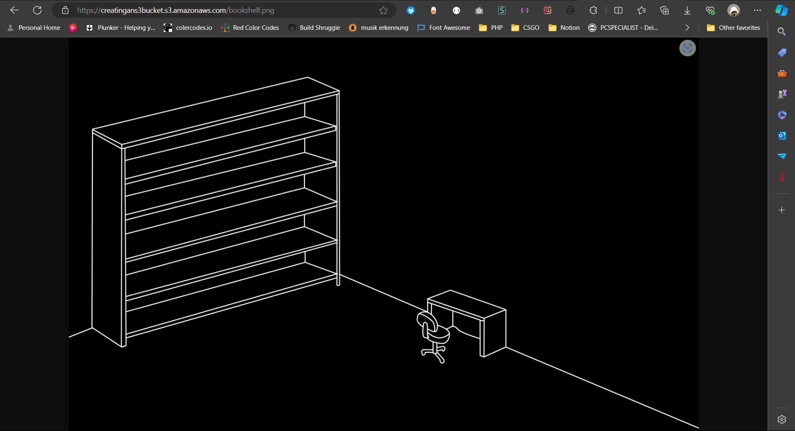


#### B) Web-Server mit PHP-Seite hinzufügen


#### C) Elastic Block Storage (EBS) hinzufügen
Ich habe zunächst ein neues Volume erstellt mit 30GB Speicher, die ich später in meine EBS mounte.
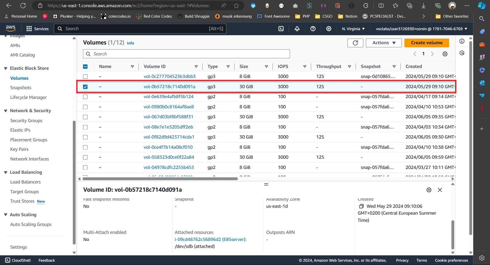
Hier habe ich mein neu erstelltes Volume in meine EBS gemounted und so sollte es auch am Ende aussehen.
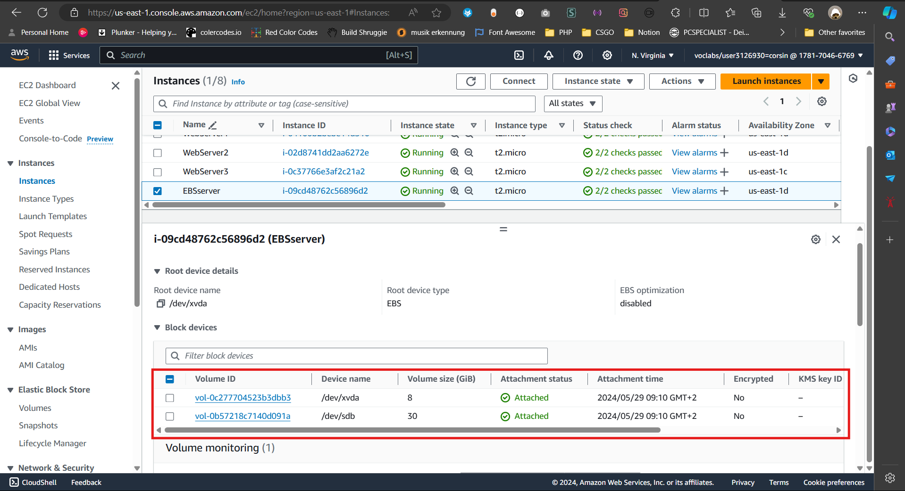
**Wichtig**: Die Zeitzonen müssen miteinander stimmen, sonst funktioniert es nicht.
